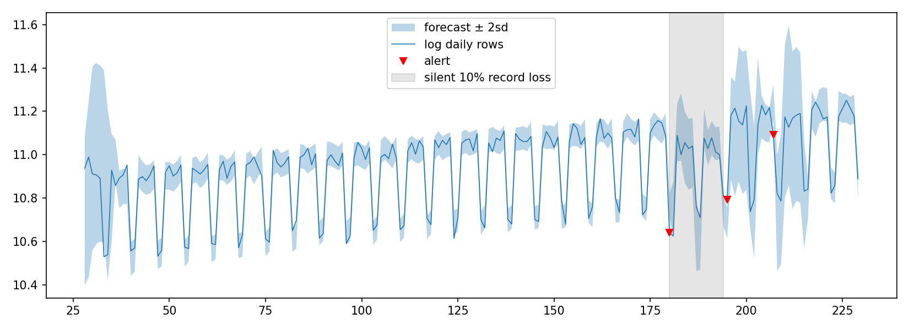

# Data Quality Monitoring with Dynamic Linear Models

Monitors daily pipeline metrics (row count, null rate, column mean) and flags when one deviates from expected behaviour.

Each metric is modelled with a Bayesian dynamic linear model that tracks its linear trend and weekly seasonality. The model forecasts each day, and a sequential likelihood ratio test flags a metric when it crosses a threshold.

## How to run

```
pip install -r requirements.txt
python run.py
```

The simulator generates a year of daily batches with DQ issues at scheduled points: a silent record loss, a duplicate load, a null-rate creep, a unit change, and a planned migration. 

`python benchmark.py` runs 40 simulations of a 14-day silent record loss against a static baseline (warmup mean plus or minus three sd):

| Metric | DLM monitor | Static threshold (3 sd) |
|---|---|---|
| Mean detection delay (days) | 1.5 | 14.0 |
| Missed (of 40) | 1 | 40 |
| False alarms before fault | 27 | 24 |

*14.0 = never detected within the 14-day window.*

The static baseline misses every loss. The band must be wide enough to contain the weekly cycle, so a 10% drop falls within it and goes undetected. Being fixed, it cannot follow the upward trend either, so normal days eventually cross its upper edge and raise false alarms. The DLM catches the loss in a day or two at a comparable false alarm rate.



## Methodology

Each metric is a dynamic linear model, filtered online, with a sequential test on its forecast errors.

**State-space model.**

$$\theta_t = F\theta_{t-1} + u_t, \qquad y_t = H\theta_t + v_t, \qquad u_t \sim N(0,U),\ \ v_t \sim N(0,V)$$

**Trend and seasonality.** The 8-dimensional state carries a local linear trend (level $\mu$, slope $\beta$) and three weekly Fourier harmonics:

$$\theta_t = (\mu,\ \beta,\ c_1,\ s_1,\ c_2,\ s_2,\ c_3,\ s_3)^\top$$

$F$ is block diagonal: a second-order polynomial trend plus one rotation per harmonic at $\omega_j = 2\pi j/7$.

```math
F = \begin{pmatrix} 1 & 1 \\ 0 & 1 \end{pmatrix} \oplus \bigoplus_{j=1}^{3} \begin{pmatrix} \cos\omega_j & \sin\omega_j \\ -\sin\omega_j & \cos\omega_j \end{pmatrix}, \qquad H = (1,0,1,0,1,0,1,0)
```

Three harmonics span the six seasonal degrees of freedom of a 7-day cycle, and $H$ reads the level plus the cosine term of each harmonic.

**Filtering.** Each day the model forecasts one step ahead, then corrects by the Kalman update:

$$f_t = HF\hat\theta_{t-1}, \qquad S_t = HP_t^- H^\top + V$$

$$K_t = P_t^- H^\top S_t^{-1}, \qquad \hat\theta_t = \theta_t^- + K_t(y_t - f_t), \qquad \hat P_t = P_t^- - K_t S_t K_t^\top$$

**Discount factor.** Instead of specifying the evolution noise $U$, the prior covariance is inflated by a discount $\delta = 0.97$:

$$P_t^- = \tfrac{1}{\delta} F\hat P_{t-1} F^\top \quad\Longleftrightarrow\quad U_t = \Big(\tfrac{1}{\delta}-1\Big)F\hat P_{t-1}F^\top$$

This gives an effective memory of roughly $1/(1-\delta) \approx 33$ days.

**Monitoring.** The standardised forecast error $e_t = |y_t - f_t|/\sqrt{S_t}$ feeds a sequential likelihood ratio test. $B_t$ is the likelihood ratio of a $\kappa$-sd shift ($\kappa = 3$) against the null, accumulated across days, and reset to 1 after an alert:

```math
B_t = \exp\!\Big(\kappa e_t - \tfrac{\kappa^2}{2}\Big), \qquad C_t = B_t \max(C_{t-1}, 1)
```

An alert is raised when $C_t > \tau$ ($\tau = 100$). The absolute value catches drops as well as spikes. A slow drift accumulates in the running product even when no single day looks off.

## Limitations

- Gaussian noise with constant variance holds well for log row count but is weaker for near-zero rates.
- Weekly seasonality only. Monthly and holiday effects need extra components.
- Metrics are monitored independently. Pooling correlated failures would improve detection.